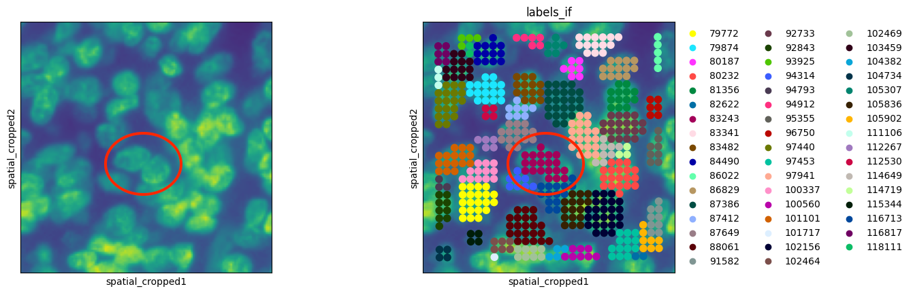
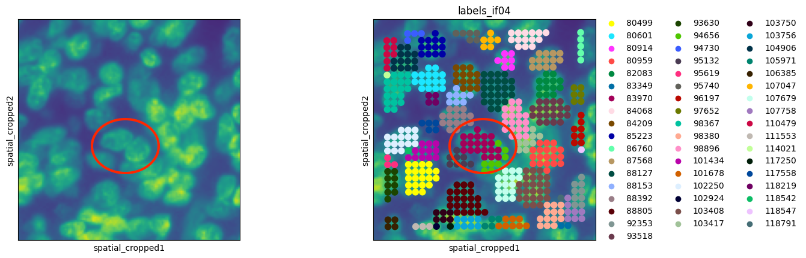
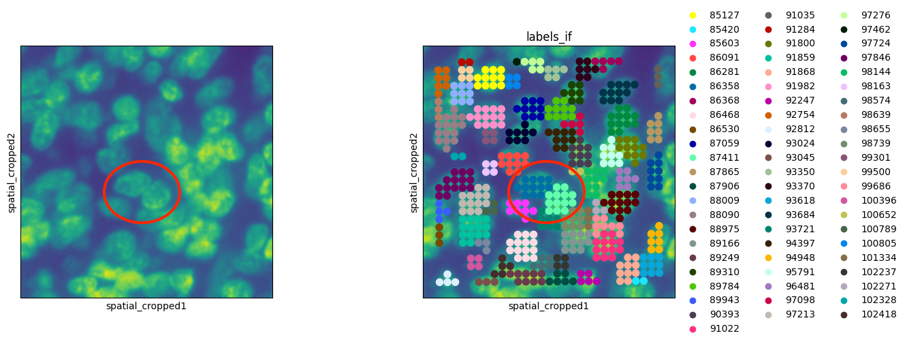

StarDist segmentation
=====================

The utility and performance of specific StarDist models (H&E or fluorescence) is highly dependent on the input image resolution. The models are tuned for a specific size-range nuclei and as such if the number of pixels per nuclei would be too high ("high resolution image") the model might find small structures as nucleoli. In a similar sense, if the number of pixels per nuclei is too low ("low resolution image") the model might find aggregates of cells or other structures as nuclei. For this reason we would recommend using the ``mpp`` (microns per pixel) range of 0.2-0.5 and test it on your data, adjusting as necessary to ensure the detected objects are nuclei. Lower ``mpp`` (higher image resolution) would sometimes lead to more accurate segmentations with the cost of speed, while larger mpp will perform fast but might be less accurate. The StarDist models were trained on images with an ``mpp`` around 0.3.

The other important parameters of the StarDist model are (1) the object probability threshold ``prob_thresh`` which is the cutoff of inclusion of a segmented object in the nuclei prediction. A lower cutoff would include more cells but might lead to more false positives. (2) ``nms_thresh`` tells the model what is the expected overlap between objects. If the nuclei are very dense they would also be expected to overlap in the image.

Example - ``mpp``
-----------------

One of the 10X demo Visium HD datasets has an IF image of the lung. A first pass at segmentation was performed on a ``mpp=0.5`` image, with ``prob_thresh=0.1``. This resulted in a number of identified objects containing multiple nuclei.

In an attempt to tease apart the fused nuclei without changing the ``mpp``, ``nms_thresh`` was raised all the way to 0.7 while ``prob_thresh`` was also increased to 0.4 to try to add more stringency. This did not manage to tease the nuclei apart, but a second peripheral object started showing up around the outskirts of one of the erroneously merged pairs. As such, StarDist was expecting to find larger objects than ones captured in the image.

A new image with ``mpp=0.35`` was generated, and ``prob_thresh`` was set back to 0.1. The segmentation drastically improved.

